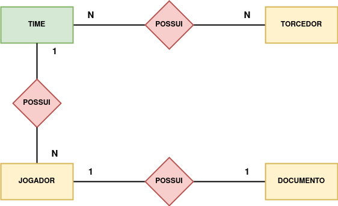

### Termos e acordos

Ao iniciar este projeto, você concorda com as diretrizes do Código de Ética e Conduta e do Manual da Pessoa Estudante da Trybe.

---

# Boas vindas ao repositório do desafio da Aceleração Java!

Você já usa o GitHub diariamente para desenvolver os exercícios, certo? Agora, para desenvolver o desafio, você deverá seguir as instruções a seguir. Fique atento a cada passo, e se tiver qualquer dúvida, nos envie por _Slack_! #vqv 🚀

Aqui você vai encontrar os detalhes de como estruturar o desenvolvimento do seu desafio a partir deste repositório, utilizando uma branch específica e um _Pull Request_ para colocar seus códigos.

---
# Instruções para entregar seu projeto

## Não se esqueça de consultar as documentações!

⚠️ **Importante**:

Esse projeto tem como intuito te treinar para ter mais familiaridade com a documentação de aplicações, por tanto, poderão haver alguns comandos ou atributos que não estão no curso, mas que devem ser descritos no decorrer dos requisitos.

Nesses casos, é importante se atentar a aquilo que o requisito pede, e lembrar sempre de utilizar a [documentação oficial](https://docs.oracle.com/en/java/javase/11/) do Java para pesquisar detalhes sobre comandos.


## Antes de começar a desenvolver

Lembre-se que você pode consultar nosso conteúdo sobre [Git & GitHub](https://course.betrybe.com/intro/git/) sempre que precisar!

1. Clone o repositório
  * Por exemplo: `git clone git@github.com:tryber/desafio-aceleracao.git`
  * Entre no diretório do repositório que você acabou de clonar:
    * neste caso `cd desafio-aceleracao`

2. Instale as dependências:
    * `mvn install`

3. Crie uma branch a partir da branch `main`

  * Verifique que você está na branch `main`
    * Exemplo: `git branch`
  * Se não estiver, mude para a branch `main`
    * Exemplo: `git checkout main`
  * Agora, crie uma branch onde você vai guardar os commits do seu desafio
    * Você deve criar uma branch no seguinte formato: `nome-de-usuario-nome-do-desafio`
    * Exemplo:
      * `git checkout -b joaozinho-acc-java-sample`

4. Adicione a sua branch com o novo `commit` ao repositório remoto

  - Usando o exemplo anterior:
    - `git push -u origin joaozinho-acc-java-sample`

5. Crie um novo `Pull Request` _(PR)_
  * Vá até a aba de _Pull Requests_ deste repositório no GitHub
  * Clique no botão verde _"New pull request"_
  * Clique na caixa de seleção _"Compare"_ e escolha a sua branch **com atenção**
  * Clique no botão verde _"Create pull request"_
  * Adicione uma descrição para o _Pull Request_ e clique no botão verde _"Create pull request"_
  * **Não se preocupe em preencher mais nada por enquanto!**
  * Volte até a página de _Pull Requests_ do repositório e confira que o seu _Pull Request_ está criado
 
 ⚠️ **Lembre-se do CheckStyle! Deixe seu Eclipse configurado para arrumar o estilo automaticamente. Qualquer dúvida, volte no conteúdo.**

---

## Durante o desenvolvimento

* ⚠ **PULL REQUESTS COM ISSUES NO CHECKSTYLE NÃO SERÃO AVALIADAS, ATENTE-SE PARA RESOLVÊ-LAS ANTES DE FINALIZAR O DESENVOLVIMENTO!** ⚠

* Faça `commits` das alterações que você fizer no código regularmente

* Lembre-se de sempre após um (ou alguns) `commits` atualizar o repositório remoto

* Os comandos que você utilizará com mais frequência são:
  1. `git status` _(para verificar o que está em vermelho - fora do stage - e o que está em verde - no stage)_
  2. `git add` _(para adicionar arquivos ao stage do Git)_
  3. `git commit` _(para criar um commit com os arquivos que estão no stage do Git)_
  4. `git push -u origin nome-da-branch` _(para enviar o commit para o repositório remoto na primeira vez que fizer o `push` de uma nova branch)_
  5. `git push` _(para enviar o commit para o repositório remoto após o passo anterior)_

---

## Depois de terminar o desenvolvimento (opcional)

Para **"entregar"** seu projeto, siga os passos a seguir:

* Vá até a página **DO SEU** _Pull Request_, adicione a label de _"code-review"_ e marque seus colegas
  * No menu à direita, clique no _link_ **"Labels"** e escolha a _label_ **code-review**
  * No menu à direita, clique no _link_ **"Assignees"** e escolha **o seu usuário**
  * No menu à direita, clique no _link_ **"Reviewers"** e digite `students`, selecione o time `tryber/students-sd-0x`

Se ainda houver alguma dúvida sobre como entregar seu projeto, [aqui tem um video explicativo](https://vimeo.com/362189205).

---

# Requisitos do desafio


# Desafio: Sistema de Gerenciamento de Times

Você é uma das pessoas programadoras envolvidas no desenvolvimento de um sistema que faz a gestão de times esportivos. Para realizar esse tipo de gestão, a empresa cliente passou uma lista de requisitos necessários.

Para auxiliar a elaboração do sistema, foi elaborado um diagrama de entidade relacionamento, exposto abaixo. 




A empresa cliente informou que os seguintes dados precisam ser armazenados no sistema:

+	**Time**
    * Identificador 
    * Nome
    * Lista de Jogadores
	 * Lista de Torcedores

+ **Jogador**
    * Identificador 
    * Nome
    * Posição
	* Documento
	* Time no qual trabalha

+ **Documento**
    * Identificador 
    * CPF
    * Número da Carteira de Trabalho
	* Número CBF

+	**Torcedor**
    * Identificador 
    * Nome

Por fim, foi definido que o identificador de cada entidade deve ser gerado automaticamente pelo sistema.

**Sua tarefa nesta demanda é construir um sistema, utilizando o framework hibernate, em que seja possível realizar operações de CRUD (CREATE, READ, UPDATE, DELETE) para todas as entidades listadas, conforme a especificação levantada.**

Para isso, você terá que:

1. Criar todas as classes Data Access Object (DAO)
2. Criar todas as classes Entity

### Dicas
1.  Analise o diagrama de entidade relacionamento e veja quais classes será necessário criar.
2. Analise o relacionamento entre as entidades, com base nela você irá escolher as anotações do hibernate que serão necessárias:

```java
@OnetoOne
@OneToMany
@ManyToOne
@ManyToMany

```

3. Como boa prática, faça camadas diferentes para responsabilidade. Por exemplo, utilize um pacote chamado dao para as classes que representem o Data Access Object.
4. Utilize o conceito de Herança para implementar as classes de Data Access Object.


Depois que você implementar esse desafio, terá feito um processo similar à construção de sistemas do mundo real, modelando os dados e construindo as operações para acesso a eles. Legal, né? #VQV

---

# Avisos Finais

Ao finalizar e submeter o desafio, não se esqueça de avaliar sua experiência preenchendo o formulário. Leva menos de 3 minutos!

Link: [Formulário](https://be-trybe.typeform.com/to/PsefzL2e)

O avaliador automático não necessariamente avalia seu projeto na ordem em que os requisitos aparecem no readme. Isso acontece para deixar o processo de avaliação mais rápido. Então, não se assuste se isso acontecer, ok?

---
